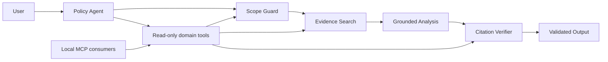

# China Policy Intelligence RAG Prototype

## Overview

This project is an offline, source-traceable research prototype for Chinese and English policy documents. Its public demonstration corpus focuses on training-data compliance and transparency for generative and general-purpose AI models in China and the European Union. It converts authorised local sources into provenance-preserving chunks, retrieves ranked evidence, and records reproducible synthetic evaluation artefacts for future grounded-analysis work.

## Problem Statement

Policy signals are often distributed across long, multilingual documents. Analysts need a disciplined way to preserve source context, retrieve relevant evidence, and communicate uncertainty when producing decision-support material.

## Intended Users

The intended users are strategy, policy, market-intelligence, and risk-analysis professionals who need transparent evidence trails rather than unsupported summaries.

## Outputs

- Structured source-grounded analysis with chunk-level citations
- Retrieval evidence records
- A structured China–EU training-data policy risk brief
- Explicit assumptions and uncertainty statements
- Deterministic claim-level citation verification and evidence-aware refusal

## Current Status

**Phase 4 implements an auditable, bounded policy-agent workflow.** It preserves the Phase 3 grounding architecture while adding typed domain tools, deterministic guardrails, loop limits, approval-gated report export, privacy-minimising local traces, a reproducible Agent Workflow Evaluation, and an optional read-only local MCP interface.

The public Phase 2.5 corpus deliberately excludes geopolitical-security strategy documents. Its human-labelled topic evidence set contains 20 relevant unique chunks, including 9 core chunks. These labels are topic-level evidence judgements, not a query-level retrieval benchmark. See [the topic scope](data/phase2_5/TOPIC_SCOPE.md) and [the corpus guide](docs/phase2_5_corpus.md).

Generation is vendor-neutral. The deterministic fake provider supports offline tests and demonstrations but makes no semantic-quality claim. An optional OpenAI Responses adapter is available behind an environment-only API key. Autonomous research, web collection, monitoring, OCR, legal advice, unrestricted chat, a production frontend, and cloud deployment are not implemented. The OpenAI Agents SDK and MCP SDK remain optional extras.

Retrieval relevance and claim grounding are different controls. Retrieval ranks candidate passages for a question; grounding verification checks that each structured claim cites supplied, permitted evidence with matching provenance. Likewise, `human_label=2` means a reviewer judged a chunk to be core topic evidence. It is not model confidence, legal certainty, or proof of semantic entailment.

## Architecture

The architecture separates local document handling, metadata validation, retrieval, evidence selection, structured generation, citation verification, rendering, and evaluation. See [the architecture](docs/architecture.md), [analysis guide](docs/analysis.md), [ingestion guide](docs/ingestion.md), [retrieval guide](docs/retrieval.md), and [evaluation guide](docs/evaluation.md).

## Installation

Python 3.11 or newer is required.

```powershell
python -m pip install -e ".[dev]"
```

Optional real structured generation requires the OpenAI extra and an environment variable:

```powershell
python -m pip install -e ".[openai]"
$env:OPENAI_API_KEY = "<set locally; never commit>"
```

For local ingestion, create a private `data/raw/manifest.yaml` from `data/raw/manifest.example.yaml` and use only authorised local files. No external service is required.

```powershell
python -m china_policy_rag.cli ingest --input-dir data/raw --manifest data/raw/manifest.yaml --output-dir data/processed
```

## Developer Commands

```powershell
python -m pytest
python -m ruff check .
python -m ruff format --check .
python -m mypy src
```

Offline grounded-analysis smoke test:

```powershell
python -m china_policy_rag.cli analysis ask `
  --question "How do China and the EU differ in training-data transparency?" `
  --evidence-set data/annotations/phase2_5_topic_relevant.csv `
  --provider fake `
  --format markdown
```

To apply formatting:

```powershell
python -m ruff format .
```

## Agentic Policy Intelligence Workflow

The single policy agent orchestrates deterministic scope, retrieval, generation, and verification tools. It cannot bypass the human evidence boundary, use label-0 chunks, or return unverified substantive analysis. Unsupported requests are refused or degraded. Read-only MCP consumers call the same domain-tool layer, while local traces record tool sequence and verification outcomes without raw prompts or secrets. See [the agent and MCP guide](docs/agent.md).



## Roadmap

1. **Phase 0:** repository foundation, configuration, and typed models.
2. **Phase 1:** local ingestion, metadata validation, provenance-preserving text preparation, and deterministic chunking.
3. **Phase 2:** persistent hybrid retrieval, metadata filtering, evidence bundles, and synthetic offline evaluation.
4. **Phase 3:** scoped structured analysis, citation verification, refusal, and a training-data risk brief.
5. **Phase 4 (current):** bounded single-agent orchestration, read-only MCP, tracing, approval, and workflow evaluation.

## Limitations

The pipeline accepts only local text, Markdown, HTML, and text-based PDFs. It does not perform OCR or fetch sources. The default offline embedding and generation providers are deterministic test doubles, not semantic-quality models. Citation verification is structural and provenance-based; it does not prove full semantic entailment or legal correctness. The curated evidence is incomplete regulatory coverage, and its topic-level labels must not be reported as query-level Recall@k or MRR performance.

## Data Provenance Principles

- Retain stable source identifiers, issuer, publication date, jurisdiction, language, URLs or local paths, and evidence locations.
- Do not fabricate documents, quotations, citations, or evaluation results.
- Record assumptions and uncertainty alongside analytical outputs.
- Use only data whose collection, storage, and use are authorised for the intended context.

## Security and Privacy Principles

- Do not commit API keys, credentials, or private documents.
- Store future secrets in environment variables or an approved secret manager.
- Keep external integrations behind interfaces and avoid making them prerequisites for local tests.
- Apply appropriate access controls and retention rules before handling sensitive source material.
