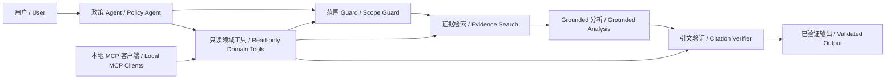

# 中国政策智能 RAG 原型 / China Policy Intelligence RAG Prototype

## 项目概述 / Overview

本项目是一个离线优先、来源可追溯的中英文政策研究原型。公开演示语料聚焦中欧生成式及通用人工智能模型的训练数据合规与透明度，并将授权的本地文档转换为保留来源信息的分块、可检索证据和可验证分析。<br>
This project is an offline-first, source-traceable research prototype for Chinese and English policy documents. Its public corpus focuses on China–EU training-data compliance and transparency for generative and general-purpose AI models, converting authorised local documents into provenance-preserving chunks, retrievable evidence, and verifiable analysis.

## 问题定义 / Problem Statement

政策信号通常分散在篇幅较长、语言不同的文件中。分析人员需要一套严谨流程，在形成决策支持材料时保留原文语境、证据出处和不确定性。<br>
Policy signals are often distributed across long, multilingual documents. Analysts need a disciplined workflow that preserves source context, evidence provenance, and uncertainty when producing decision-support material.

## 目标用户 / Intended Users

本项目面向需要透明证据链而非无依据摘要的战略、政策、市场情报和风险分析人员。<br>
The project is intended for strategy, policy, market-intelligence, and risk-analysis professionals who need transparent evidence trails rather than unsupported summaries.

## 主要输出 / Outputs

- 带有 chunk 级引文的来源约束分析 / Source-grounded analysis with chunk-level citations
- 可检查的检索证据记录 / Inspectable retrieval evidence records
- 结构化的中欧训练数据政策风险简报 / A structured China–EU training-data policy risk brief
- 明确记录的假设、不确定性和证据缺口 / Explicit assumptions, uncertainties, and evidence gaps
- 确定性的声明级引文验证和证据不足拒答 / Deterministic claim-level citation verification and evidence-aware refusal

## 当前状态 / Current Status

Phase 4 已实现可审计、受约束的政策智能 agent 工作流。系统保留 Phase 3 的 grounding 架构，同时加入类型化领域工具、确定性 guardrails、循环限制、需审批的报告导出、本地隐私最小化 trace、可复现的 Agent Workflow Evaluation，以及可选的只读本地 MCP 接口。<br>
Phase 4 implements an auditable, bounded policy-intelligence agent workflow. It preserves the Phase 3 grounding architecture while adding typed domain tools, deterministic guardrails, loop limits, approval-gated report export, privacy-minimising local traces, a reproducible Agent Workflow Evaluation, and an optional read-only local MCP interface.

公开的 Phase 2.5 语料有意排除地缘政治安全战略文件。人工主题标注集合包含 20 个唯一相关 chunk，其中 9 个为核心 chunk；这些标签是主题级证据判断，不是 query-level 检索 benchmark。详见[主题范围 / topic scope](data/phase2_5/TOPIC_SCOPE.md)和[语料说明 / corpus guide](docs/phase2_5_corpus.md)。<br>
The public Phase 2.5 corpus deliberately excludes geopolitical-security strategy documents. Its human-labelled topic set contains 20 unique relevant chunks, including 9 core chunks; these labels are topic-level evidence judgements, not a query-level retrieval benchmark. See the [主题范围 / topic scope](data/phase2_5/TOPIC_SCOPE.md) and [语料说明 / corpus guide](docs/phase2_5_corpus.md).

生成层支持多个 provider。默认离线测试使用 deterministic fake provider；真实模型可选择 OpenAI Responses provider 或 DeepSeek OpenAI-compatible provider。无论使用哪个模型，输出都必须通过相同的 Pydantic schema 和确定性引文验证器。<br>
The generation layer supports multiple providers. Offline tests default to the deterministic fake provider, while real runs may use either the OpenAI Responses provider or the DeepSeek OpenAI-compatible provider. Regardless of model, outputs must pass the same Pydantic schemas and deterministic citation verifier.

检索相关性与声明 grounding 是两个不同控制层：检索负责排序候选段落，grounding 验证负责检查每个结构化声明是否引用了已提供、允许且法域一致的证据。`human_label=2` 仅表示人工审阅者认为该 chunk 是核心主题证据，不代表模型置信度、法律确定性或语义蕴含证明。<br>
Retrieval relevance and claim grounding are separate controls: retrieval ranks candidate passages, while grounding verification checks that each structured claim cites supplied, permitted, jurisdiction-consistent evidence. `human_label=2` means only that a reviewer judged a chunk to be core topic evidence; it is not model confidence, legal certainty, or proof of semantic entailment.

## LLM Provider 支持 / LLM Provider Support

| Provider / 提供方 | 环境变量 / Environment variable | 默认模型 / Default model | 接口 / Interface |
| --- | --- | --- | --- |
| Fake / 离线测试 | 无 / None | `deterministic-fake-v1` | 无网络 / Offline |
| DeepSeek | `DEEPSEEK_API_KEY` | `deepseek-v4-flash` | OpenAI-compatible Chat Completions JSON mode |
| OpenAI | `OPENAI_API_KEY` | 必须显式指定 / Explicit model required | Responses structured output |

DeepSeek provider 固定使用官方 `https://api.deepseek.com` base URL，并默认选择适合成本敏感测试的 `deepseek-v4-flash`；可通过 `--model` 覆盖。密钥只从环境变量读取，不会写入配置、日志或 trace。实现依据 [DeepSeek JSON Output 文档](https://api-docs.deepseek.com/guides/json_mode/)；OpenAI provider 延续 [OpenAI API 官方文档](https://developers.openai.com/api/)所描述的结构化输出方式。<br>
The DeepSeek provider uses the fixed official `https://api.deepseek.com` base URL and defaults to `deepseek-v4-flash` for cost-conscious testing; override it with `--model` when needed. Keys are read only from environment variables and are never written to configuration, logs, or traces. The implementation follows the [DeepSeek JSON Output documentation](https://api-docs.deepseek.com/guides/json_mode/), while the OpenAI provider retains structured output following the [official OpenAI API documentation](https://developers.openai.com/api/).

## 架构 / Architecture

架构将本地文档处理、元数据验证、检索、证据选择、结构化生成、引文验证、渲染和评估彼此分离。详见[架构 / architecture](docs/architecture.md)、[分析 / analysis](docs/analysis.md)、[摄取 / ingestion](docs/ingestion.md)、[检索 / retrieval](docs/retrieval.md)和[评估 / evaluation](docs/evaluation.md)。<br>
The architecture separates local document handling, metadata validation, retrieval, evidence selection, structured generation, citation verification, rendering, and evaluation. See [架构 / architecture](docs/architecture.md), [分析 / analysis](docs/analysis.md), [摄取 / ingestion](docs/ingestion.md), [检索 / retrieval](docs/retrieval.md), and [评估 / evaluation](docs/evaluation.md).



## 安装 / Installation

项目需要 Python 3.11 或更高版本；开发和完整离线测试只需要 `dev` extra。<br>
Python 3.11 or newer is required; development and the complete offline test suite need only the `dev` extra.

```powershell
python -m pip install -e ".[dev]"
```

使用 DeepSeek 进行低成本真实模型测试时，安装 `deepseek` extra，并只在当前终端设置密钥。不要把真实密钥写入 `.env.example` 或提交到 Git。<br>
For lower-cost real-model testing with DeepSeek, install the `deepseek` extra and set the key only in the current terminal. Never write a real key to `.env.example` or commit it to Git.

```powershell
python -m pip install -e ".[deepseek]"
$env:DEEPSEEK_API_KEY = "<set locally; never commit>"

python -m china_policy_rag.cli analysis ask `
  --question "How do China and the EU differ in training-data transparency?" `
  --evidence-set data/annotations/phase2_5_topic_relevant.csv `
  --provider deepseek `
  --model deepseek-v4-flash `
  --format markdown
```

使用 OpenAI 时安装 `openai` extra、设置 `OPENAI_API_KEY`，并显式指定模型。<br>
For OpenAI, install the `openai` extra, set `OPENAI_API_KEY`, and provide an explicit model.

```powershell
python -m pip install -e ".[openai]"
$env:OPENAI_API_KEY = "<set locally; never commit>"

python -m china_policy_rag.cli analysis ask `
  --question "How do China and the EU differ in training-data transparency?" `
  --evidence-set data/annotations/phase2_5_topic_relevant.csv `
  --provider openai `
  --model "<supported-model-id>" `
  --format markdown
```

本地摄取只处理授权文件，不会下载外部来源。请从 `data/raw/manifest.example.yaml` 创建私有 `data/raw/manifest.yaml`。<br>
Local ingestion processes authorised files only and does not download external sources. Create a private `data/raw/manifest.yaml` from `data/raw/manifest.example.yaml`.

```powershell
python -m china_policy_rag.cli ingest `
  --input-dir data/raw `
  --manifest data/raw/manifest.yaml `
  --output-dir data/processed
```

## 开发命令 / Developer Commands

以下命令构成项目的最低工程验收门槛。<br>
The following commands form the project's minimum engineering acceptance gate.

```powershell
python -m pytest
python -m ruff check .
python -m ruff format --check .
python -m mypy src
```

离线 smoke test 不需要任何 API key，也不会产生网络调用。<br>
The offline smoke test requires no API key and makes no network calls.

```powershell
python -m china_policy_rag.cli agent run `
  --question "How do China and the EU differ in training-data transparency?" `
  --provider fake `
  --show-tools `
  --trace-local
```

## Agentic 政策智能工作流 / Agentic Policy Intelligence Workflow

单一 policy agent 只负责协调确定性的范围判断、检索、生成和验证工具。它不能绕过人工证据边界、使用 label-0 chunk 或返回未经验证的实质性分析；不受支持的问题会被拒绝或降级。只读 MCP 客户端调用相同的领域工具层，本地 trace 只记录工具序列和验证结果，不记录原始问题、完整证据或密钥。详见 [agent 与 MCP 指南 / agent and MCP guide](docs/agent.md)。<br>
The single policy agent coordinates deterministic scope, retrieval, generation, and verification tools only. It cannot bypass the human evidence boundary, use label-0 chunks, or return unverified substantive analysis; unsupported requests are refused or degraded. Read-only MCP clients call the same domain-tool layer, while local traces record tool sequence and verification outcomes without raw questions, full evidence, or keys. See the [agent 与 MCP 指南 / agent and MCP guide](docs/agent.md).

## 路线图 / Roadmap

1. **Phase 0：**建立仓库标准、配置和类型化模型。 / Establish repository standards, configuration, and typed models.
2. **Phase 1：**实现本地摄取、元数据验证和可追溯文本处理。 / Implement local ingestion, metadata validation, and provenance-preserving text preparation.
3. **Phase 2：**实现持久化混合检索、证据包和离线评估。 / Implement persistent hybrid retrieval, evidence bundles, and offline evaluation.
4. **Phase 3：**实现范围受限的结构化分析、引文验证、拒答和风险简报。 / Implement scoped structured analysis, citation verification, refusal, and a risk brief.
5. **Phase 4（当前）：**实现受约束的单 agent 编排、只读 MCP、trace、审批和工作流评估。 / Implement bounded single-agent orchestration, read-only MCP, tracing, approval, and workflow evaluation.

## 限制 / Limitations

管道只接受本地 TXT、Markdown、HTML 和文本型 PDF，不执行 OCR 或来源抓取。离线 fake provider 不代表语义质量；引文验证检查结构与来源，但不能证明完整语义蕴含或法律正确性。当前证据集并非完整监管覆盖，其主题级标签不得被报告为 query-level Recall@k 或 MRR。<br>
The pipeline accepts only local TXT, Markdown, HTML, and text-based PDFs; it performs neither OCR nor source fetching. The offline fake provider makes no semantic-quality claim, and citation verification checks structure and provenance without proving full semantic entailment or legal correctness. The evidence set is not complete regulatory coverage, and its topic-level labels must not be reported as query-level Recall@k or MRR.

## 数据来源原则 / Data Provenance Principles

- 保留稳定的来源 ID、发布机构、日期、法域、语言、URL 或本地路径以及证据位置 / Retain stable source IDs, issuers, dates, jurisdictions, languages, URLs or local paths, and evidence locations
- 不伪造文件、引文、引用或评估结果 / Never fabricate documents, quotations, citations, or evaluation results
- 在分析结果中同时记录假设和不确定性 / Record assumptions and uncertainty alongside analytical outputs
- 仅使用已获授权且适合目标场景的数据 / Use only data authorised for the intended context

## 安全与隐私原则 / Security and Privacy Principles

- 不提交 API key、凭据或私有文件 / Never commit API keys, credentials, or private documents
- 仅通过环境变量或批准的 secret manager 提供密钥 / Supply secrets only through environment variables or an approved secret manager
- 外部 provider 保持可选，完整自动化测试始终离线 / Keep external providers optional and the complete automated test suite offline
- 在处理敏感来源前应用适当的访问控制和保留规则 / Apply appropriate access controls and retention rules before handling sensitive source material
