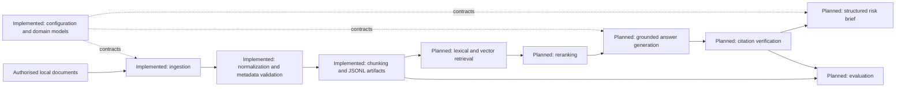

# Proposed Architecture

## Implementation Status

The **domain models**, **configuration layer**, **local document ingestion**, **metadata validation**, **text normalization**, **chunking**, and **JSONL serialization** are implemented in Phase 1. Retrieval and generation components remain planned future work.

## Design Principles

- Preserve traceable source metadata and evidence locations throughout the workflow.
- Keep provider-specific integrations behind interfaces.
- Separate retrieval, generation, citation checking, and evaluation for independent testing.
- Treat uncertainty as an explicit output, not an implicit confidence claim.

## Proposed Component Boundaries

| Component | Status | Responsibility |
| --- | --- | --- |
| Configuration layer | Implemented | Read local defaults and future provider settings from the environment. |
| Domain models | Implemented | Validate shared records for sources, retrieval, citations, answers, and risk briefs. |
| Document ingestion | Implemented | Import authorised local TXT, Markdown, HTML, and text-based PDF documents. |
| Text normalization | Implemented | Conservatively normalize Unicode and whitespace while retaining paragraph boundaries. |
| Metadata validation | Implemented | Validate a YAML manifest and local paths before ingestion. |
| Chunking | Implemented | Create deterministic paragraph-aware, evidence-addressable text segments. |
| JSONL serialization | Implemented | Persist processed documents, chunks, and a machine-readable report locally. |
| Storage | Planned | Add durable indexed storage beyond Phase 1 artifacts. |
| Embedding provider | Planned | Generate embeddings through an isolated provider interface. |
| Lexical and vector retrieval | Planned | Retrieve candidate evidence using complementary methods. |
| Reranking | Planned | Order retrieved evidence for a specific question. |
| Grounded answer generation | Planned | Produce answers constrained by retrieved evidence. |
| Citation verification | Planned | Check citation presence, source identity, and evidence location. |
| Structured risk-brief generation | Planned | Build validated decision-support briefs. |
| Evaluation | Planned | Run versioned, reproducible quality checks. |
| Optional agent and MCP extensions | Planned | Add bounded orchestration only after core workflows are validated. |

## Future Extension Notes

An optional agent or MCP layer may coordinate approved tools in a later phase, but it must not obscure evidence provenance or bypass citation verification. It should remain separate from the core domain and retrieval interfaces.
