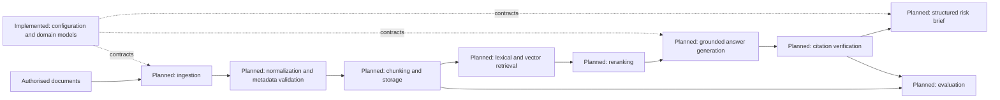

# Proposed Architecture

## Implementation Status

Only the **domain models** and **configuration layer** are implemented in Phase 0. Every other component described below is planned future work. This document is a design proposal, not a claim of current functionality.

## Design Principles

- Preserve traceable source metadata and evidence locations throughout the workflow.
- Keep provider-specific integrations behind interfaces.
- Separate retrieval, generation, citation checking, and evaluation for independent testing.
- Treat uncertainty as an explicit output, not an implicit confidence claim.

## Proposed Component Boundaries

| Component | Status | Responsibility |
| --- | --- | --- |
| Configuration layer | Implemented | Read local defaults and future provider settings from the environment. |
| Domain models | Implemented | Validate shared records for sources, retrieval, citations, answers, and risk briefs. |
| Document ingestion | Planned | Import authorised local or connected source documents. |
| Text normalization | Planned | Produce consistent text while retaining provenance. |
| Metadata validation | Planned | Check required source metadata before indexing. |
| Chunking | Planned | Create evidence-addressable text segments. |
| Storage | Planned | Persist documents, chunks, and metadata. |
| Embedding provider | Planned | Generate embeddings through an isolated provider interface. |
| Lexical and vector retrieval | Planned | Retrieve candidate evidence using complementary methods. |
| Reranking | Planned | Order retrieved evidence for a specific question. |
| Grounded answer generation | Planned | Produce answers constrained by retrieved evidence. |
| Citation verification | Planned | Check citation presence, source identity, and evidence location. |
| Structured risk-brief generation | Planned | Build validated decision-support briefs. |
| Evaluation | Planned | Run versioned, reproducible quality checks. |
| Optional agent and MCP extensions | Planned | Add bounded orchestration only after core workflows are validated. |

## Future Extension Notes

An optional agent or MCP layer may coordinate approved tools in a later phase, but it must not obscure evidence provenance or bypass citation verification. It should remain separate from the core domain and retrieval interfaces.
