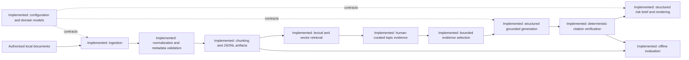

# Proposed Architecture

## Implementation Status

Phase 4 adds a bounded single orchestrator, typed domain tools, local tracing, approval-gated export, workflow evaluation, and optional read-only MCP. Existing deterministic evidence and verification services remain authoritative. Optional provider and SDK access remains isolated and is not required offline.

## Design Principles

- Preserve traceable source metadata and evidence locations throughout the workflow.
- Keep provider-specific integrations behind interfaces.
- Separate retrieval, generation, citation checking, and evaluation for independent testing.
- Treat uncertainty as an explicit output, not an implicit confidence claim.

## Proposed Component Boundaries

| Component | Status | Responsibility |
| --- | --- | --- |
| Configuration layer | Implemented | Read local defaults and future provider settings from the environment. |
| Domain models | Implemented | Validate shared records for sources, retrieval, citations, answers, and risk briefs. |
| Document ingestion | Implemented | Import authorised local TXT, Markdown, HTML, and text-based PDF documents. |
| Text normalization | Implemented | Conservatively normalize Unicode and whitespace while retaining paragraph boundaries. |
| Metadata validation | Implemented | Validate a YAML manifest and local paths before ingestion. |
| Chunking | Implemented | Create deterministic paragraph-aware, evidence-addressable text segments. |
| JSONL serialization | Implemented | Persist processed documents, chunks, and a machine-readable report locally. |
| Storage | Implemented | Persist local lexical/vector indexes and versioned evidence artefacts. |
| Embedding provider | Implemented | Use deterministic tests or optional local sentence-transformers. |
| Lexical and vector retrieval | Implemented | Retrieve candidate evidence using complementary methods. |
| Reranking | Planned | Order retrieved evidence for a specific question. |
| Topic evidence store | Implemented | Load labels 1/2 with exact provenance and mechanically exclude label 0. |
| Evidence selection and sufficiency | Implemented | Enforce evidence budgets, core preference, scope, and jurisdiction coverage. |
| Grounded answer generation | Implemented | Produce validated structured data before rendering. |
| Citation verification | Implemented | Check citations, labels, provenance, jurisdiction, and support rules. |
| Structured risk-brief generation | Implemented | Build a bounded China–EU training-data risk brief. |
| Evaluation | Implemented | Run synthetic retrieval plumbing tests and offline grounding tests. |
| Policy agent | Implemented | Orchestrate approved tools with deterministic routing and loop limits. |
| Read-only MCP adapter | Implemented | Expose six allowlisted tools over optional local stdio. |
| Agent Workflow Evaluation | Implemented | Measure routing, refusal, tool use, verification, and coverage offline. |

## Phase 4 boundaries

The single-agent choice keeps control flow inspectable and avoids handoff ambiguity. Policy logic remains deterministic; direct tools and MCP are adapters over the same services. Human approval is required only when materialising a final report. See [the detailed agent architecture and security review](agent.md). Agent autonomy is deliberately constrained.
